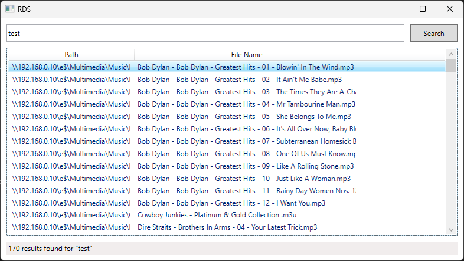

RDS
=====

RDS is a WPF app that searches an SQLite database for file matches.




## Usage

Run the app
Configure directories via the system tray menu -> Configure
Scan the directories to store the info in the SQLite database (system tray menu -> Scan)
Show the main form (system tray menu -> Show, or the global hotkey Ctrl+Alt+Backspace)
Type a partial filename [enter]
Focus automatically changes to the listview, use the cursor keys and [enter] to execute the default shell command for the selected file
Press ESC to close the form


## Compiling

To clone and run this application, you'll need [Git](https://git-scm.com) and [.NET](https://dotnet.microsoft.com/) installed on your computer. From your command line:

```
# Clone this repository
$ git clone https://github.com/btigi/rds

# Go into the repository
$ cd src

# Build  the app
$ dotnet build
```

## Licencing

RDS is licenced under the MIT License. Full licence details are available in licence.md

RDS uses the 'find magnifying glass' icon by [Dawood icons](https://icon-icons.com/authors/325-dawood-icons) licenced under [CC BY 4.0](https://creativecommons.org/licenses/by/4.0/)